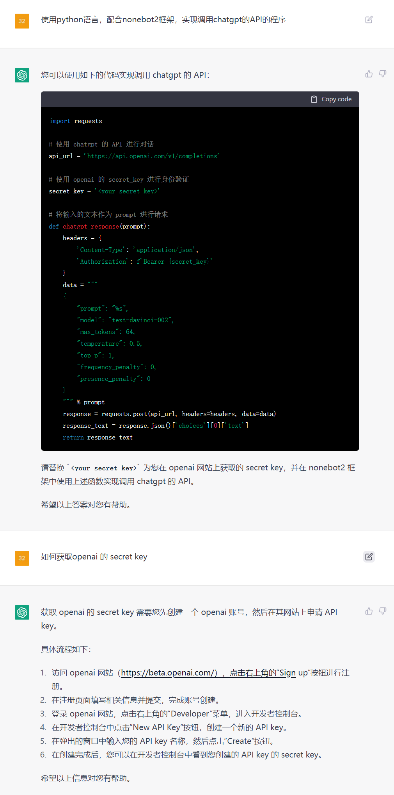

<div align="center">
  <a href="https://v2.nonebot.dev/store"></a>
  <br>
  <p></p>
</div>

<div align="center">

# nonebot_plugin_chatGPT
  
_✨ NoneBot openAI chatGPT插件 ✨_
  
<a href="https://github.com/Ikaros-521/nonebot_plugin_chatGPT/stargazers">
    
</a>
<a href="https://github.com/Ikaros-521/nonebot_plugin_chatGPT/issues">
    
</a>
<a href="https://github.com/Ikaros-521/nonebot_plugin_chatGPT/network">
    
</a>
<a href="./LICENSE">
    
</a>
<a href="https://pypi.python.org/pypi/nonebot_plugin_chatGPT">
    
</a>
<a href="https://www.python.org">
    
</a>

</div>

适用于nonebot2 v11的openAI chatGPT插件，部分源码由chatGPT编写。    
调用的相关API源自api.openai.com  

## 🔧 开发环境
Nonebot2：2.0.0b5  
python：3.8.13  
操作系统：Windows10（Linux兼容性问题不大）  
编辑器：pycharm  

## 💿 安装
环境依赖`aiohttp`库   
且需要注册openAI账号，获取secret key，配置env后才能正常使用！  

### 1. nb-cli安装（推荐）
在你bot工程的文件夹下，运行cmd（运行路径要对啊），执行nb命令安装插件，插件配置会自动添加至配置文件  
```
nb plugin install nonebot_plugin_chatGPT
```

### 2. 本地安装
先安装下 `aiohttp`
```
pip install aiohttp
```
将项目clone到你的机器人插件下的对应插件目录内（一般为机器人文件夹下的`src/plugins`），然后把`nonebot_plugin_chatGPT`文件夹里的内容拷贝至上一级目录即可。  
clone命令参考（得先装`git`，懂的都懂）：
```
git clone https://github.com/Ikaros-521/nonebot_plugin_chatGPT.git
``` 
也可以直接下载压缩包到插件目录解压，然后同样提取`nonebot_plugin_chatGPT`至上一级目录。  
目录结构： ```你的bot/src/plugins/nonebot_plugin_chatGPT/__init__.py```  


### 3. pip安装
```
pip install nonebot_plugin_chatGPT
```  
打开 nonebot2 项目的 ```bot.py``` 文件, 在其中写入  
```nonebot.load_plugin('nonebot_plugin_chatGPT')```  
当然，如果是默认nb-cli创建的nonebot2的话，在bot路径```pyproject.toml```的```[tool.nonebot]```的```plugins```中添加```nonebot_plugin_chatGPT```即可  
pyproject.toml配置例如：  
``` 
[tool.nonebot]
plugin_dirs = ["src/plugins"]
plugins = ["nonebot_plugin_chatGPT"]
``` 

### 更新版本
```
nb plugin update nonebot_plugin_chatGPT
```

## 🔧 配置

### secret key获取方式
获取 openai 的 secret key 需要您先创建一个 openai 账号，然后在其网站上申请 API key。  

具体流程如下：  

1、访问 openai 网站（https://beta.openai.com/），点击右上角的“Sign up”按钮进行注册。  
2、在注册页面填写相关信息并提交，完成账号创建。  
3、登录 openai 网站，点击右上角的“Developer”菜单，进入开发者控制台。  
4、在开发者控制台中点击“New API Key”按钮，创建一个新的 API key。  
5、在弹出的窗口中输入您的 API key 名称，然后点击“Create”按钮。  
6、在创建完成后，您可以在开发者控制台中看到您创建的 API key 的 secret key。  

### env配置
```
# 在你的env文件中添加如下配置（我的是.env.prod）  
chatGPT_secret_key="sk-xxxxxxxxxxxxxxxxxxxxxxxxxxxxxxxxxxxxxxxxxxxxxxxx"
```
|       配置项        | 必填 | 默认值  |                      说明                      |
|:----------------:|:----:|:----:|:----------------------------:|
| `chatGPT_secret_key` | 是 | `""` | 参考上文secret key获取方式 |


## 🎉 功能
调用chatGPT的API接口获取请求返回直接输出，简单粗暴。  

## 👉 命令

### /gpt 或 /GPT 或 /chatGPT
命令结构：```/gpt [你想问的内容]```  
例如：```/gpt 用python实现hello world``` 或 ```/GPT 你叫什么名字``` 或 ```/chatGPT 今天是什么日子```  
bot返回内容：  


## ⚙ 拓展
自己动手丰衣足食  
  

## 📝 更新日志

<details>
<summary>展开/收起</summary>

### 0.0.1

- 插件初次发布  

</details>

## 致谢
- [chat.openai.com](https://chat.openai.com)
